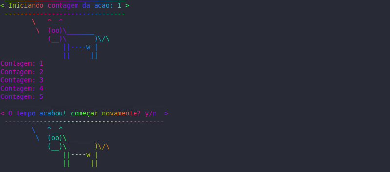
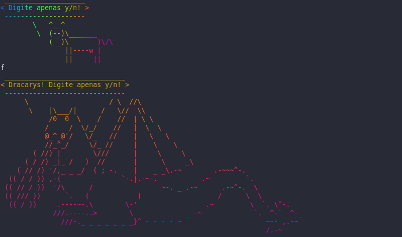

# cronometroshell
Um cronometro regressivo em shell script que pode ser divertido ou não.
O foco inicial desse script era para limpar a caixa de entrada usando o método GTD, contudo ele acabou ganhando novas funcionlidades e podem ser usado para outros contextos.


## Pré requisitos

Pacotes utilizados:
```
cowsay
lolcat
aplay
```

## Baixando

Clonado o repositorio para o computador local
```
git clone https://github.com/smartao/cronometroshell.git
```

## Configurações
No arquivo ``variaveis`` é possível fazer algumas alterações no funcionamento do script, as instruções de funcionamento estão nesse arquivo

## Execução

### Iniciando

#### Basico

Podemos apenas executar o script, ele executará uma contagem regressiva em segundos baseado no valor configurado no arquivo ``variaveis`` que por padrão é 120 segundos.

```
./cronometroshell.sh
```

#### Denfinindo o tempo

Podemos definir um tempo em segundos para a execucação do cronometro

```
./cronometroshell.sh 10
```



### Ao longo da execução

#### Inputs

Ao longo da execução podemos apertar a tecla ``n`` para avançar para a próxima contagem ou a tecla ``e`` para sair do programa

#### Reexecução

Quando o tempo acabar podemos escolher entre uma nova contagem ou sair do programa.

##### Fun mode

Se o fun mode estiver ativo, variavel ``fun=2``, e caso o tempo acabe e não seja dado uma resposta satisfatório repetidas vezes um dragão pode aparecer!



